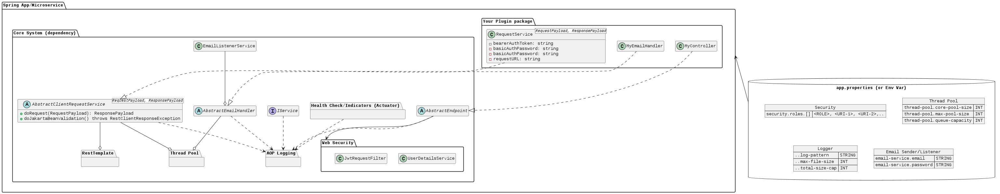

# Whats this?

Spring module to be used as dependency that pre-configures and initializes commonly used.
This would same boilerplate configuration as well as unify the logging mechanisim, making it easiser for log monitoring tools. 

[](docs/readme.puml)

# Pre-configured features:

+ API and Service Logging
    + uses AOP to configure MDC context traceable map and produce logs across pointcuts for `@Controller` and `@Service`
+ Thread Pool
   + Configure thread pool for `@Async` processes using the provided properties, otherwise falls back to pre-configured values.
+ `AbstractClientRequestService`
   + "Decorator" for internal request service
   + Handles request headers authentication
   + Validates the request and response bodies, using Bean Validation
   + Sets MDC context map for AOP logging
+ Email service
   +  
+ API Authorization
  + Secures API endpoints using `<ROLE>,<URI>` pair list.
  + Requests with valid JWT tokens gets access to their `<ROLE>` endpoints.
+ Health Indicators and schduled reports
  + Plugins the Spring Auctator
  + 

# Usage:

### 1. Maven dependency:
+ Clone this repo.
+ `mvn install`

### 2. Maven dependency:

Add `<dependency>` into `pom.xml` of the disered app:
```xml
<dependency>
    <groupId>yoga1290</groupId>
    <artifactId>core-system</artifactId>
    <version>1.0.0</version>
</dependency>
<!-- TBA: will add <repository> later on; gonna make use of github maven registry & github actions -->
```

### 3. Configuration Properties:

To scan the required components/package, you will need to add this entrypoint class:
```java
import yoga1290.commons.ImportCommons;
//...
@SpringBootApplication
@Import({ ImportCommons.class})
//..
```

# References:

+ [Spring | Custom Logs Configuration](https://docs.spring.io/spring-boot/docs/3.2.x/reference/htmlsingle/#features.logging.custom-log-configuration)
+ [Baeldung | Guide to Spring Email](https://www.baeldung.com/spring-email)
+ [Your First Full Stack Application with Angular and Spring Boot](https://github.com/in28minutes/full-stack-with-angular-and-spring-boot#core-jwt-components---spring-boot-3)
+ [DZone | Setting Up MDC Context With AOP in Spring Boot Applications](https://dzone.com/articles/setting-up-mdc-context-with-aop-in-spring-boot-app)
+ [Mkyong | package javax.validation.constraints does not exist](https://mkyong.com/spring-boot/package-javax-validation-constraints-does-not-exist/)
+ [Spring | Spring Security without the WebSecurityConfigurerAdapter](https://spring.io/blog/2022/02/21/spring-security-without-the-websecurityconfigureradapter)