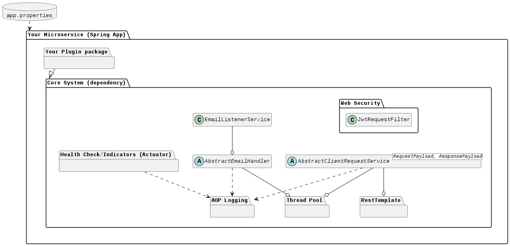
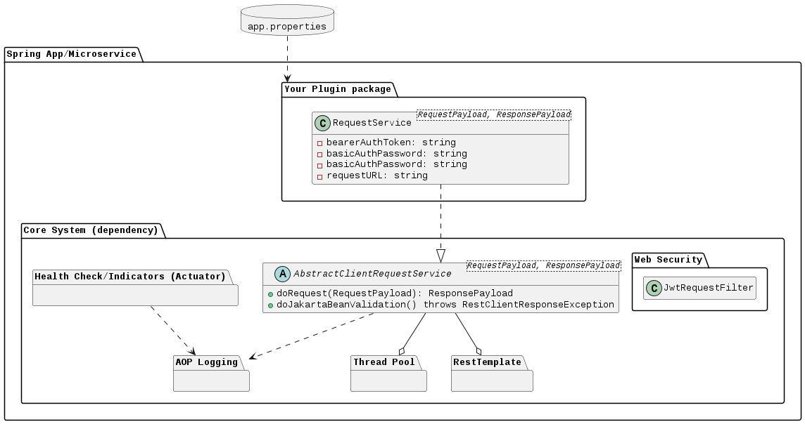

# Whats this?

Spring module to be used as dependency that pre-configures and initializes commonly used configurations and services.
This would same boilerplate configuration as well as unify the logging mechanisim, making it easiser for log monitoring tools. 


# Overview

[](docs/readme-overview.puml)

[](docs/readme.puml)


+ API and Service Logging
+ Thread Pool
+ HTTP Client Service
+ Email Sender & Listener Service
+ API Authentication & Authorization
+ Enables Spring Auctator and logs the Health Indicators

---

### Authentication & Authorization

+ Regarding Authorization, `JwtRequestFilter` is a `OncePerRequestFilter` that verifies that every request has a URI that maps to either `PUBLIC` role, or to one of the `roles` of the [`JWTPayload`](src/main/java/models/JwtPayload)
   + Mapping URIs to ROLEs are done through the app properties, in the following format: ```` 
+ Regarding Authentication, `JWTService` will be injected into the Plugin component, so the plugin controller or whatsoever service can handle issuing and/or verification of the JWT tokens without much implementation.
+ JWT Key is set using app property: `yoga1290.commons.jwt.secret`

### HTTP Clients Services

[](docs/readme-client-service.puml)

+ Service Components must implement `AbstractClientRequestService<RequestDTO, ResponseDTO>`; where the `RequestDTO` and `ResponseDTO` are the expected DTO models send and received through the external REST API endpoint.
+ Services will get AOP Logging by default, since the Abstract class implements the `IService` Marker Interface.
+ Handles request headers authentication
+ Validates the request and response bodies, using Bean Validation
+ Sets MDC context map for AOP logging
+ Sample/Example:

```java
@Service
public class RecaptchClientService 
    extends AbstractClientRequestService<RecaptchRequestDTO, RecaptchResponseDTO> {


    public RecaptchClientService(
            @Value("${yoga1290.client-service.headerBearerToken:}")
            String headerBearerToken,
            RestTemplate restTemplate) {

        super(  new RecaptchResponse(),
                headerBearerToken, //or user,pass
                restTemplate);
    }

    public ResponseEntity<RecaptchResponseDTO> doRequest(/*...*/) {
        return this.doPost( requestUrl,
                            recaptchRequestDTO);
    }

}

```


### Email Sender/Listener Service

+ By default, Email Service gets injected but not enabled by default.
+ Use App-Password, if the GMail has a 2MF

```properties
########## EMAIL SERVICE #############
email-service.enable=false # sender service; false by default
email-service.imap.enable=false # listener service; false by default
email-service.email=...
email-service.password=... # GMail App-Password if 2MF is set.
```

### ThreadPool

+ Configure thread pool for `@Async` processes using the provided properties, otherwise falls back to pre-configured values.
+ be default, if they were not set; it gets initialized by values below:

```properties
################ THREAD-POOL ##############
yoga1290.commons.thread-pool.core-pool-size=50
yoga1290.commons.thread-pool.max-pool-size=50
yoga1290.commons.thread-pool.queue-capacity=10
yoga1290.commons.thread-pool.thread-name-prefix=thread-
```

### API and Service Logging

+ uses AOP to configure MDC context traceable map and produce logs across pointcuts for `@Controller` and `@Service`
+ Preset values and properties:
```properties
################ LOGGING ##################
# SEE https://docs.spring.io/spring-boot/docs/3.2.x/reference/htmlsingle/#features.logging.custom-log-configuration
# SEE https://docs.spring.io/spring-boot/docs/3.2.x/reference/htmlsingle/#features.logging.file-output
###########################################
logging.file.name=${LOG_FILE:${HOSTNAME:localhost}}
logging.file.path=${LOG_PATH:logs}
log-pattern=%d{HH:mm:ss.SSS} [%thread] | %-5level %logger{36} | uri: %mdc{URI} | tansactionId: %mdc{TRANSACTION_ID} | %msg%n
#FILE_LOG_PATTERN
logging.pattern.file=${log-pattern}
#CONSOLE_LOG_PATTERN
logging.pattern.console=${log-pattern}
logging.logback.rollingpolicy.max-file-size=${LOGBACK_ROLLINGPOLICY_MAX_FILE_SIZE:5000}
logging.logback.rollingpolicy.total-size-cap=${LOGBACK_ROLLINGPOLICY_TOTAL_SIZE_CAP:50000}
```


# Usage:

### 1. Install maven dependency:

+ Install from artifact file:
  + Get the URL of the `microkernel-core-system-X.Y-Z.jar` artifact from the [Package page](https://github.com/yoga1290?tab=packages&repo_name=microkernel-core-system).
  + Run this:
```bash
ARTIFACT_JAR_URL="#TODO artifact URL here";
curl -o microkernel-core-system-3.3-1.jar $ARTIFACT_JAR_URL;

mvn install:install-file \
   -Dfile=microkernel-core-system-X.Y-Z.jar \
   -DgroupId=yoga1290 \
   -DartifactId=microkernel-core-system \
   -Dversion=X.Y-Z \
   -Dpackaging=jar
```
+ Another option would be to, clone this repo, and run: `mvn clean install` to install dependency to local `.m2` Maven repository.

### 2. Add `pom.xml` dependency:

Add `<dependency>` into `pom.xml` of the disered app:
```xml
<dependency>
    <groupId>yoga1290</groupId>
    <artifactId>microkernel-core-system</artifactId>
    <version>1.0.0</version>
</dependency>
<!-- TBA: will add <repository> later on; gonna make use of github maven registry & github actions -->
```

### 3. Setup & Import Configurations:

To scan the required components/package, you will need to add this entrypoint class:
```java
import yoga1290.commons.ImportCommons;
//...
@SpringBootApplication
@Import({ ImportCommons.class})
//..
```

# CI/CD

The [`push-mvn-registry.sh`](ci/push-mvn-registry/push-mvn-registry.sh) shell script gets triggered, and based on the initiator, whather it is through a **Github Action** or **Gitlab Action**, it make use of the following predefined environment variables to generate the necessary `pom.xml` and `settings.xml` configurations, depending on the `MVN_PROFILE` and executes the `mvn clean install deploy` on a docker container:

+ `MVN_PROFILE` (github|gitlab)
+ `USERNAME`
+ `GIT_REPOSITORY_NAME`
+ `ACCESS_TOKEN`

### GitHub Actions
+ Entry point: [`.github/workflows/main_workflow.yml`](.github/workflows/main_workflow.yml)
+ Maven dependency gets published in the repo's [Package page](https://github.com/yoga1290?tab=packages&repo_name=microkernel-core-system)

### GitLab Actions
+ Entry point: [`.gitlab-ci.yml`](.gitlab-ci.yml)

# References:

+ [Spring | Custom Logs Configuration](https://docs.spring.io/spring-boot/docs/3.2.x/reference/htmlsingle/#features.logging.custom-log-configuration)
+ [Baeldung | Guide to Spring Email](https://www.baeldung.com/spring-email)
+ [Your First Full Stack Application with Angular and Spring Boot](https://github.com/in28minutes/full-stack-with-angular-and-spring-boot#core-jwt-components---spring-boot-3)
+ [DZone | Setting Up MDC Context With AOP in Spring Boot Applications](https://dzone.com/articles/setting-up-mdc-context-with-aop-in-spring-boot-app)
+ [Mkyong | package javax.validation.constraints does not exist](https://mkyong.com/spring-boot/package-javax-validation-constraints-does-not-exist/)
+ [Spring | Spring Security without the WebSecurityConfigurerAdapter](https://spring.io/blog/2022/02/21/spring-security-without-the-websecurityconfigureradapter)